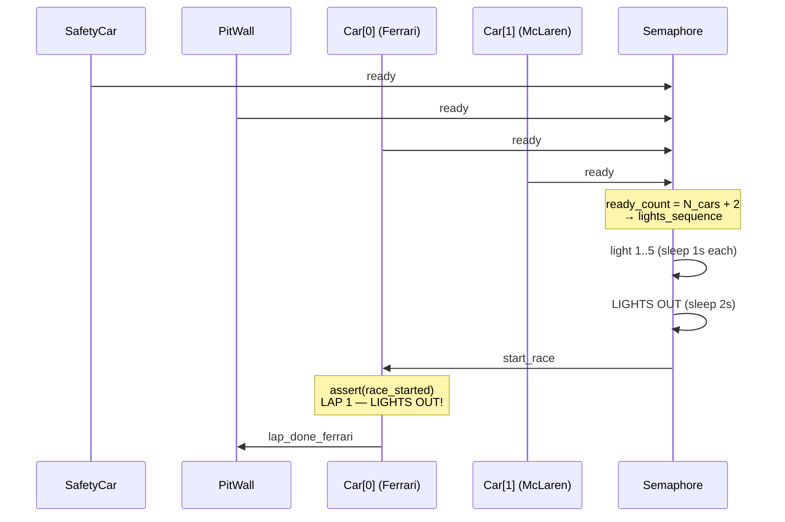
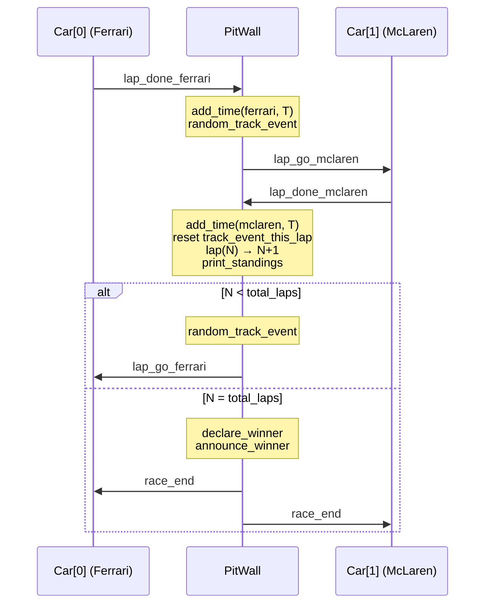
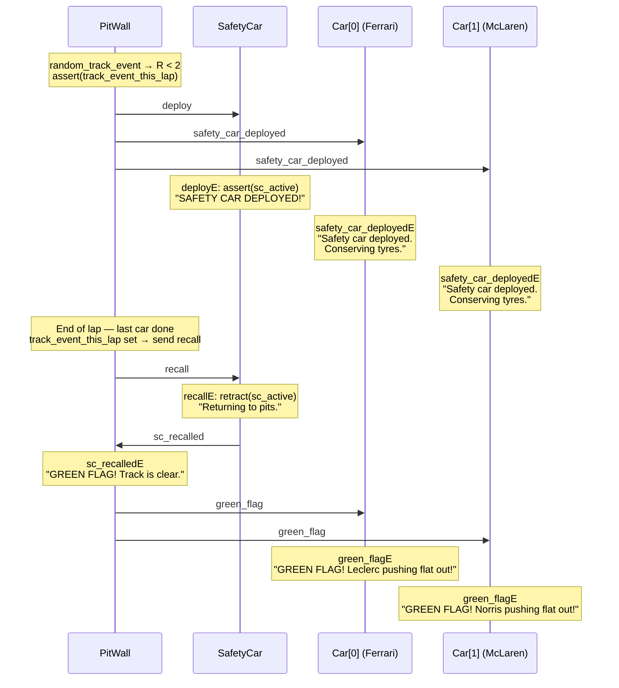
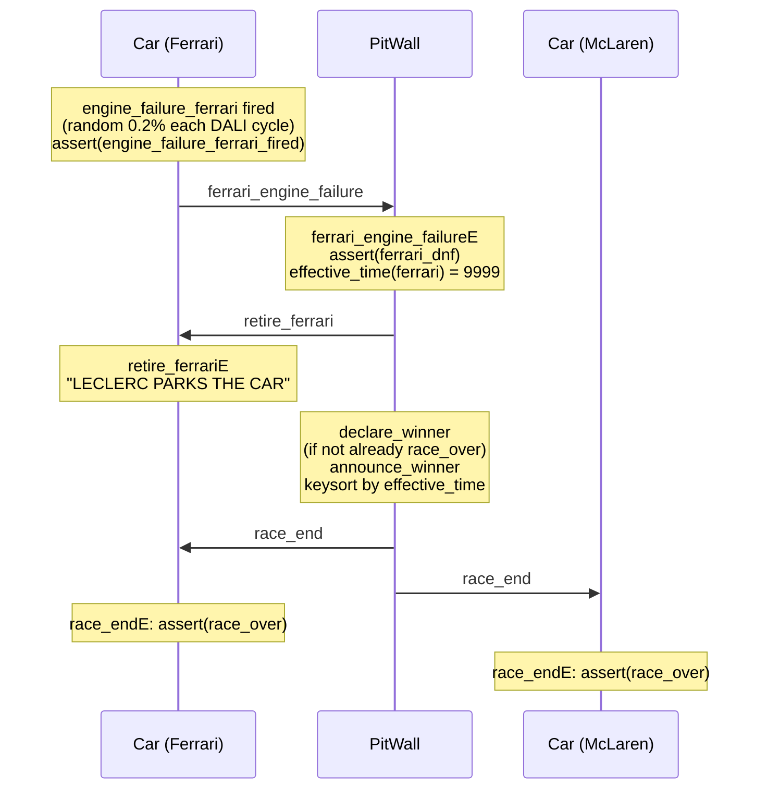
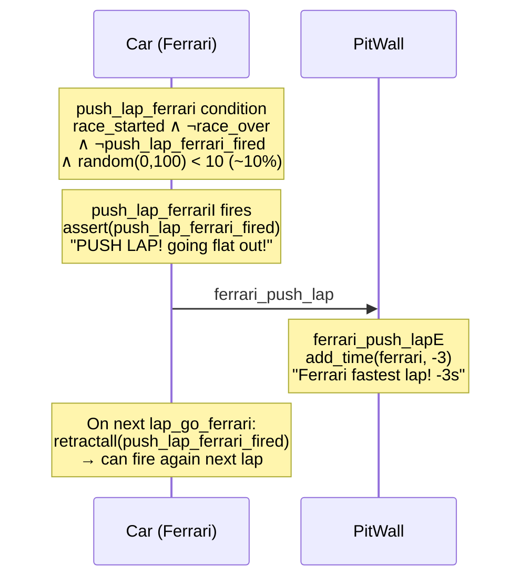

# F1 Race — DALI Multi-Agent Simulation

A Formula 1 race simulation built with the **DALI Multi-Agent System** framework.  
Car agents are **dynamically generated** from a single `agents.json` config file — no hardcoded agents in the codebase.  
The **Pit Wall** coordinates the race flow and generates **probabilistic events** (safety car, rain) automatically.

---

## Agents

The car roster is defined in `agents.json`. The fixed infrastructure agents never change:

| Agent | Instance | Type | Role |
|-------|----------|------|------|
| `semaphore` | `mas/instances/semaphore.txt` | `semaphoreType` | Raccoglie i segnali `ready`, esegue la sequenza luci F1 e avvia la gara |
| *(car agents)* | `mas/instances/{id}.txt` | `{id}Car` | Generati da `agents.json` via `generate_agents.py` |
| `pitwall` | `mas/instances/pitwall.txt` | `pitWallType` | Muretto box, coordinatore e generatore di eventi casuali |
| `safety_car` | `mas/instances/safety_car.txt` | `safetyCarType` | Safety car |

### Default car roster (`agents.json`)

| ID | Team | Driver | Car |
|----|------|--------|-----|
| `ferrari` | Ferrari | Leclerc | SF-24 |
| `mclaren` | McLaren | Norris | MCL38 |
| `redbull` | Red Bull | Verstappen | RB20 |
| `mercedes` | Mercedes | Hamilton | W15 |

> Add or remove cars by editing `agents.json` only — everything else is generated automatically.

### Race flow (N laps, round-robin)

```
All agents ──send_message(ready)──► Semaphore
                                        │ (waits N_cars + 2 ready signals)
                                        │ send_message(start_race)
                                        ▼
                                    Car[0]  ── lap_done_[0] ──►  PitWall
                                                                      │ rolls random lap time + random_track_event
                                                                      │ lap_go_[1]
                                                                      ▼
                                                                  Car[1]  ── lap_done_[1] ──►  PitWall
                                                                                                    │ ...
                                                                                                    ▼
                                                                                                Car[N-1] ── lap_done_[N-1] ──► PitWall
                                                                                                                                    │ increments lap counter
                                                                                                                                    │ prints standings
                                                                                                                                    │ if lap < total: random_track_event → lap_go_[0]
                                                                                                                                    │ if lap = total: declare_winner
                                                                                                                                    ▼
                                                                                                                                ...repeat total_laps times...
```

At any point a car's **internal event** (`engine_failureI` or `push_lapI`) can fire autonomously and send a message to PitWall.

---

### Timing system (lower total time = winner)

| Event | Time change |
|---|---|
| Each lap | `+ random(60..90)` seconds |
| Pit stop | `+ 25s` |
| Safety car (20% chance per lap) | `+ 10s` to all cars |
| Heavy rain (20% chance per lap) | `+ 5s` to all cars |
| Push lap (internal event, ~10% chance) | `- 3s` |
| Engine failure / DNF (internal event, ~0.2% chance) | `time = 9999s` → race ends |

---

### DALI event types used

**External events** (`nameE:>`) — reactive, triggered by a message from another agent:
- `start_raceE` — lights out signal from semaphore; asserts `race_started`, triggers first lap
- `lap_go_{id}E` — pitwall tells a car to start its next lap
- `lap_done_{id}E` — car finishes a lap; pitwall adds random lap time, rolls track event
- `pit_done_{id}E` — car finishes pit stop; pitwall adds +25s
- `{id}_engine_failureE` — DNF notification to pitwall; sets time to 9999s
- `{id}_push_lapE` — fastest-lap bonus; subtracts 3s
- `race_endE` — sent by pitwall after `declare_winner`; asserts local `race_over` to stop internal events
- `rain_warningE`, `safety_car_deployedE` — cosmetic notifications to cars *(guarded: silently ignored if `race_over`)*
- `green_flagE` — sent by pitwall when safety car is recalled; car reacts with a push message
- `retire_{id}E` — car parks; cosmetic notification

**Internal events** (`nameI:>`) — proactive, fire autonomously when condition is true:
```prolog
% Generated per-car in {id}Car.txt
engine_failure_{id} :-
    race_started,                        % only after race begins
    \+ race_over,                        % only while race is live
    \+ engine_failure_{id}_fired,        % fire at most once
    random(0, 1000, R), R < 2.
engine_failure_{id}I:>
    assert(engine_failure_{id}_fired),
    send_m(pitwall, send_message({id}_engine_failure, {id})).

push_lap_{id} :-
    race_started,
    \+ race_over,
    \+ push_lap_{id}_fired,              % fire at most once per lap (reset each lap_go)
    random(0, 100, R), R < 10.
push_lap_{id}I:>
    assert(push_lap_{id}_fired),
    send_m(pitwall, send_message({id}_push_lap, {id})).
```

**Non-determinism** — `random_track_event/0` in PitWall, rolled mid-race (never on last lap, at most once per lap via `track_event_this_lap` flag):
```prolog
random_track_event :-
    if(track_event_this_lap, true,           % at most one event per lap
        (random(0, 10, R),
         if(R < 2, /* 20% SAFETY CAR +10s */,
         if(R < 4, /* 20% RAIN +5s */,
            true)))).
```

**Safety car recall chain** — when the last car of a lap resets `track_event_this_lap`:
```
PitWall ──recall──► SafetyCar
                        │ recallE: retract(sc_active), send sc_recalled → PitWall
                        ▼
                    PitWall sc_recalledE: "GREEN FLAG!" + send green_flag → all cars
                        │
                        ▼
                    Car green_flagE: driver reaction message
```

---

## Dynamic Agent System

Car agents are **not hardcoded** anywhere. The entire pipeline is driven by `agents.json`:

```
agents.json
    └──► generate_agents.py
              ├── mas/instances/{id}.txt       (one per car)
              ├── mas/types/{id}Car.txt        (one per car)
              ├── mas/types/pitWallType.txt    (round-robin over all cars)
              ├── mas/types/semaphoreType.txt  (waits N_cars + 2 ready signals)
              └── mas/types/safetyCarType.txt
```

`generate_agents.py` is called automatically by `startmas.sh` every launch. It is **smart about regeneration**:

| Situation | Behaviour |
|-----------|-----------|
| `agents.json` unchanged (same car IDs on disk) | Skips — no files written |
| New car added to `agents.json` | Full regeneration |
| Car removed from `agents.json` | Stale `{id}.txt` / `{id}Car.txt` deleted, then full regeneration |
| `--force` flag | Always regenerates unconditionally |

### Adding or removing a car

Edit `agents.json`:

```json
{
  "total_laps": 5,
  "cars": [
    { "id": "ferrari",  "team": "Ferrari",  "car_model": "SF-24",  "driver": "Leclerc",    "label": "Ferrari SF-24",  "color": "#180505", "border": "#cc2200" },
    { "id": "myclubcar","team": "My Club",  "car_model": "X1",     "driver": "Rossi",      "label": "Club X1",        "color": "#001020", "border": "#00aaff" }
  ]
}
```

Then run `bash startmas.sh` — all DALI files and the dashboard update automatically.

---

> For installation and setup instructions, see [SETUP.md](SETUP.md).

---

## Dashboard Features

| UI element | Function |
|---|---|
| **&#8635; Restart MAS** | Kills SICStus + tmux session, reruns `startmas.sh` |
| **⚠ Deploy SC** | Sends deploy message to safety car immediately |
| **✓ Recall SC** | Recalls the safety car |
| **Agent: / Command:** bar | Send any arbitrary Prolog command to any agent pane |
| ↓ pin button | Toggle auto-scroll for that pane |
| ✕ button | Clear pane output |
| − button | Minimize pane to tray |

---

## Project Structure

```
f1_race/
├── agents.json          # ← Single source of truth for all car agents
├── generate_agents.py   # ← Generates DALI files from agents.json
├── startmas.sh          # Launch script (calls generate_agents.py, then starts MAS)
├── docker-compose.yml   # Docker Compose (mas + ui containers)
├── .env.example         # Template for SICSTUS_PATH
├── .dockerignore
├── docker/
│   ├── setup.sh         # Auto-detects SICStus, writes .env
│   ├── mas/Dockerfile
│   └── ui/Dockerfile
├── ui/
│   ├── dashboard.py     # Flask backend — reads agents.json dynamically each request
│   ├── static/
│   │   ├── app.js       # Frontend — syncConfig() auto-detects agent changes every 5s
│   │   └── index.html
│   ├── run.sh           # Creates venv + launches dashboard (stamp-based pip skip)
│   └── requirements.txt
├── mas/
│   ├── instances/
│   │   ├── semaphore.txt      # fixed
│   │   ├── pitwall.txt        # fixed
│   │   ├── safety_car.txt     # fixed
│   │   └── {id}.txt           # generated per car
│   └── types/
│       ├── semaphoreType.txt  # generated (waits N_cars + 2 ready)
│       ├── pitWallType.txt    # generated (round-robin over N cars)
│       ├── safetyCarType.txt  # generated
│       └── {id}Car.txt        # generated per car
├── conf/
│   ├── communication.con
│   ├── makeconf.sh / .bat
│   └── startagent.sh / .bat
├── build/               # Runtime (auto-generated)
├── work/                # Runtime (auto-generated)
└── log/                 # Runtime (auto-generated)
```

---

## Sequence Diagrams

### 1 — Startup



### 2 — Lap Round-Robin



### 3 — Safety Car: Deploy, Recall, Green Flag Chain



### 4 — Engine Failure / DNF



### 5 — Push Lap (Internal Event)



---

## DALI Syntax Reference (used in this project)

| Syntax | Meaning | Example |
|--------|---------|---------|
| `nameE:> Body.` | React to external event `name` | `start_raceE:> write('Go!').` |
| `nameI:> Body.` | Fire internal event when condition `name` holds | `push_lap_ferrariI:> send_m(pitwall, ...).` |
| `name :- Cond.` | Condition for internal event `nameI` | `push_lap_ferrari :- race_started, \+ race_over, ...` |
| `messageA(agent, msg)` | Send a message (top-level clause only) | `messageA(pitwall, send_message(lap_done_ferrari, ferrari)).` |
| `send_m(agent, msg)` | Send a message (safe inside `if/3`) | `send_m(safety_car, send_message(deploy, pitwall)).` |
| `random(Low, High, R)` | Random integer `Low =< R < High` | `random(0, 10, R).` |
| `if(Cond, Then, Else)` | Conditional | `if(R < 5, send_m(...), true).` |
| `\+ Goal` | Negation-as-failure | `\+ race_over` |
| `:- Goal.` | Directive (runs at load time) | `:- write('Agent ready!').` |
| `keysort(+Pairs, -Sorted)` | Sort list of `Key-Value` pairs by key | `keysort([3-b, 1-a], S).` |
